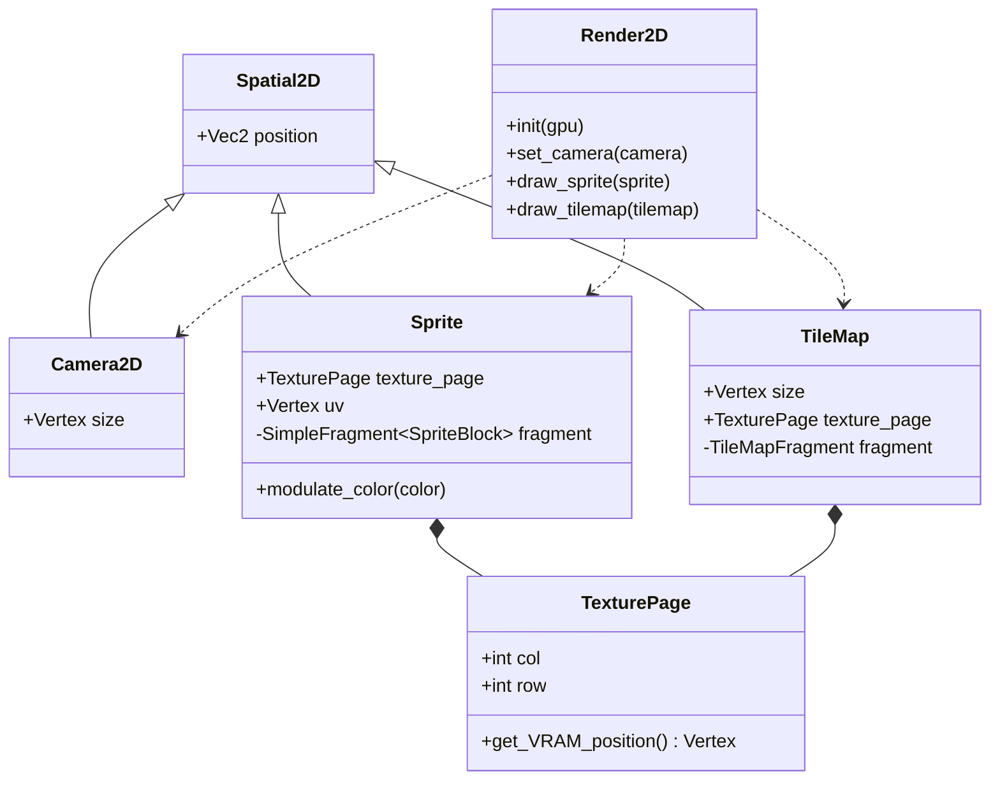

# Class Diagram

```mermaid
classDiagram
  class Spatial2D {
    +Vec2 position
  }
  Spatial2D <|-- Camera2D
  Spatial2D <|-- Sprite
  Spatial2D <|-- TileMap
  class Camera2D {
    +Vertex size
  }
  class Sprite {
    +TexturePage texture_page
    +Vertex uv
    -SimpleFragment~SpriteBlock~ fragment
    +modulate_color(color)
  }
  Sprite *-- TexturePage
  class TileMap {
    +Vertex size
    +TexturePage texture_page
    -TileMapFragment fragment
  }
  TileMap *-- TexturePage
  class TexturePage {
    +int col
    +int row
    +get_VRAM_position() Vertex
  }
  class Render2D {
    +init(gpu)
    +set_camera(camera)
    +draw_sprite(sprite)
    +draw_tilemap(tilemap)
  }
  Render2D ..> Camera2D
  Render2D ..> Sprite
  Render2D ..> TileMap
```
